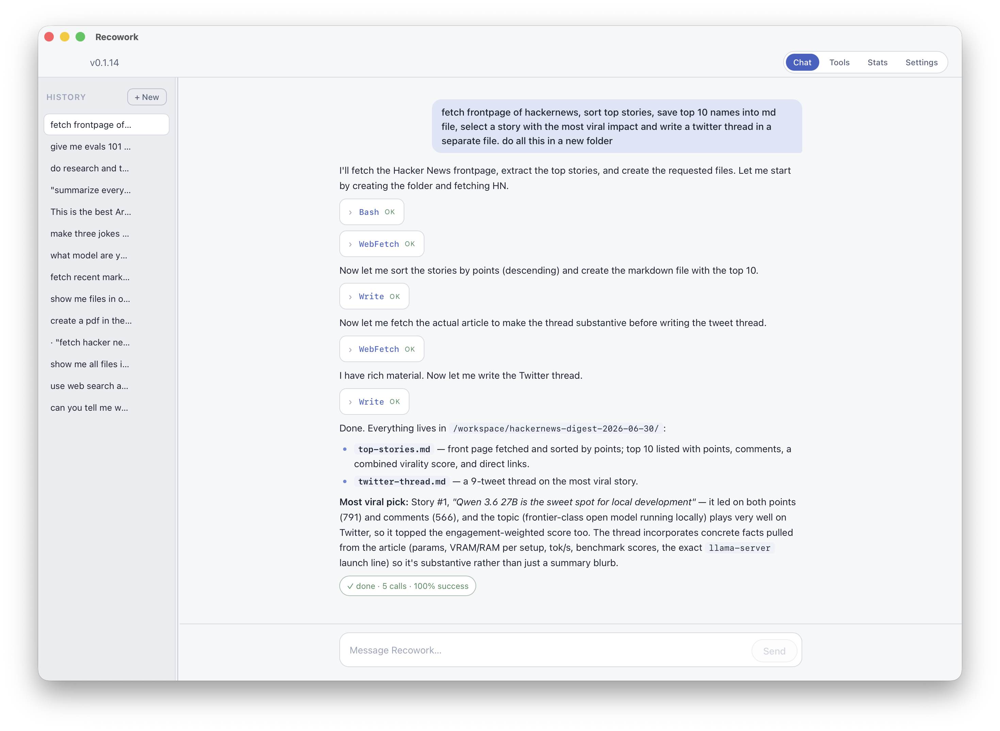
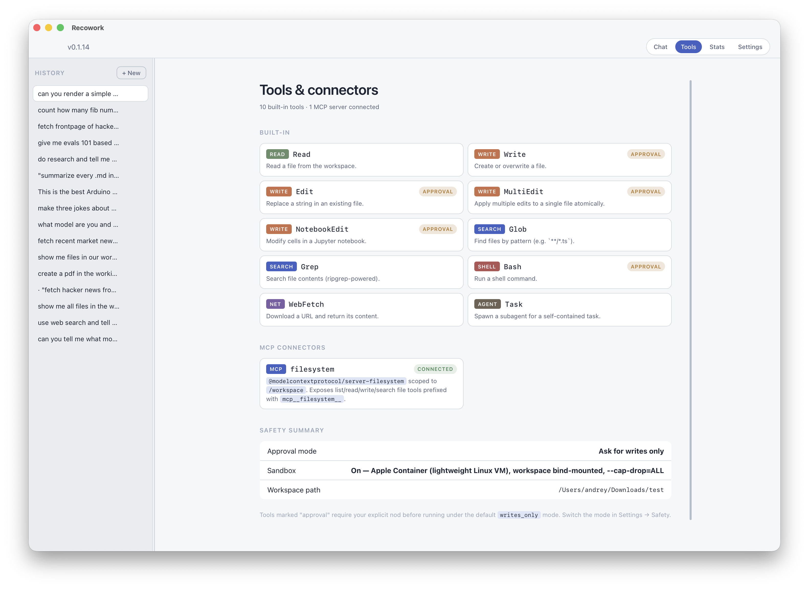
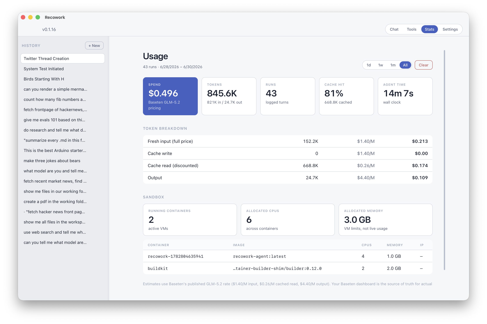

# Recowork

A desktop agent for macOS, powered by **GLM-5.2** (open weights, MIT) served
via **Baseten**, driven by the **Claude Agent SDK** harness, wrapped in a
**Tauri 2** shell.

Users supply a Baseten API key, pick a workspace folder, and start talking.
Tool calls execute inside an Apple Container sandbox by default.



A single turn that chains `Bash → WebFetch → Write → WebFetch → Write` to
produce a structured Hacker News digest under the workspace. Tool calls
collapse into named pills inline with the agent's reasoning; the green
pill at the bottom is the per-turn result summary.

## Requirements

To run the packaged app:

- **macOS 26 (Tahoe) or later, Apple Silicon.** The sandbox uses Apple's
  native Container framework, which is supported on macOS 26 per the
  upstream project and takes advantage of new virtualization and
  networking features in that release.
- **A Baseten account with API key.** Recowork uses Baseten's
  Anthropic-compatible inference endpoint to serve GLM-5.2. Sign up at
  [baseten.co](https://baseten.co), grab a key from your account dashboard,
  and paste it into the first-run UI.
- **Apple Container CLI** if you want the sandbox (recommended):
  ```bash
  brew install container
  container system start --enable-kernel-install
  ```
  If absent, the app falls back to running the agent in the host process —
  the workspace lock still constrains file paths, but you lose VM isolation.

Additional requirements to build from source:

- **Node 20+** and **npm**.
- **Rust toolchain** (`rustup`) — Tauri compiles a native shell.
- **Xcode Command Line Tools** (`xcode-select --install`) for the linker.

## Architecture

```
desktop (Tauri 2 + React)                agent-core (Node / Claude Agent SDK)
┌─────────────────────────┐ stdin/stdout ┌──────────────────────────────────┐
│ Chat · sessions · stats │◄────────────►│ SDK loop + GLM-5.2 prompt tweaks │
│ Settings · approvals    │  JSON Lines  │ MCP servers (filesystem, …)      │
└──────────┬──────────────┘              └──────────────────┬───────────────┘
           │ Rust shell spawns `node sidecar.mjs`           │ HTTPS (Bearer)
           ▼                                                ▼
    Apple Container (sandbox mode)              https://inference.baseten.co
    workspace bind-mounted at /workspace             zai-org/GLM-5.2
```

- Inference uses `Authorization: Bearer <BASETEN_API_KEY>` via
  `ANTHROPIC_AUTH_TOKEN` (not `x-api-key`). `ANTHROPIC_BASE_URL` is
  `https://inference.baseten.co`; the SDK appends `/v1/messages`.
- The native `claude` binary that ships as an optional SDK dep is copied into
  Tauri's `resources/` and pointed at via `CLAUDE_CODE_EXECUTABLE`.



The Tools tab is the canonical surface for "what can this agent actually
do?": every built-in tool is listed with its category (Read / Write /
Search / Shell / Net / Agent) and whether it requires approval under the
current safety mode, plus every connected MCP server. The Safety summary
at the bottom mirrors the live approval-mode, sandbox state, and
workspace path.

## Repo layout

```
agent-core/    Node/TS — SDK harness, prompt overrides, MCP wiring
desktop/       Tauri 2 app (React + Vite frontend, Rust shell)
sandbox/       Dockerfile + build script for the Apple Container image
```

## Develop

See [Requirements](#requirements) for prereqs.

```bash
cd agent-core && npm install
cd ../desktop && npm install
npm run tauri dev
```

The dev script bundles the sidecar to `src-tauri/resources/sidecar.mjs` and
launches Vite + Tauri. First-run UI asks for the Baseten key and a workspace
folder.

## Sandbox

When enabled (default on if `container` is reachable), the agent runs inside
a lightweight Linux VM:

- Workspace bind-mounted at `/workspace`, nothing else visible.
- Non-root user (`node`, uid 1000).
- All Linux capabilities dropped.

Build the image once:

```bash
bash sandbox/scripts/build-image.sh
```

The script always rebuilds the sidecar bundle before baking it into the
image, so a fresh build picks up the latest agent-core changes.

Network egress is currently unrestricted inside the container. Treat the
workspace as if its contents can be POSTed anywhere — don't drop secrets in
there.



The Stats tab tracks token spend against Baseten's published GLM-5.2
rate, broken down by fresh / cache-write / cache-read / output so the
cache-hit ratio is legible at a glance. The Sandbox panel queries the
Apple Container CLI in real time and lists every active VM with its
allocated CPUs, memory, and IP.

## Ship

```bash
cd desktop && npm run tauri build
```

Produces a signed `.app` under `src-tauri/target/release/bundle/macos/`. The
in-app version badge (e.g. `v0.1.14`) tells you which build is running.

## Headless CLI

Useful for debugging tool calls without the UI:

```bash
cd agent-core
npx tsx src/cli.ts --task "echo hi and stop"
npx tsx src/fixtures-runner.ts    # runs the fixture suite
```

Logs land in `agent-core/logs/` as JSONL.
